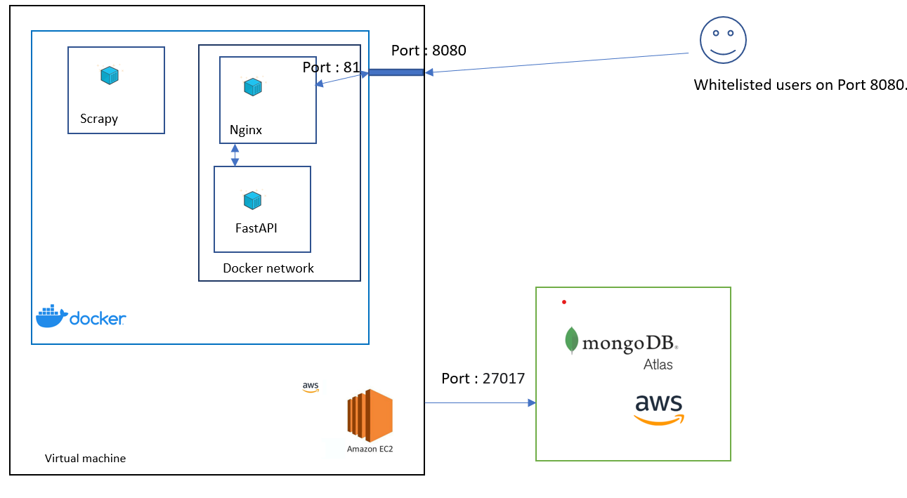
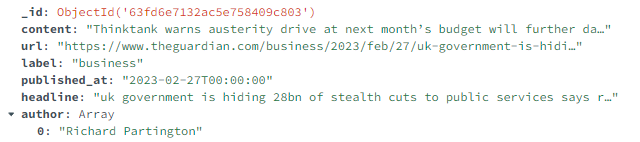
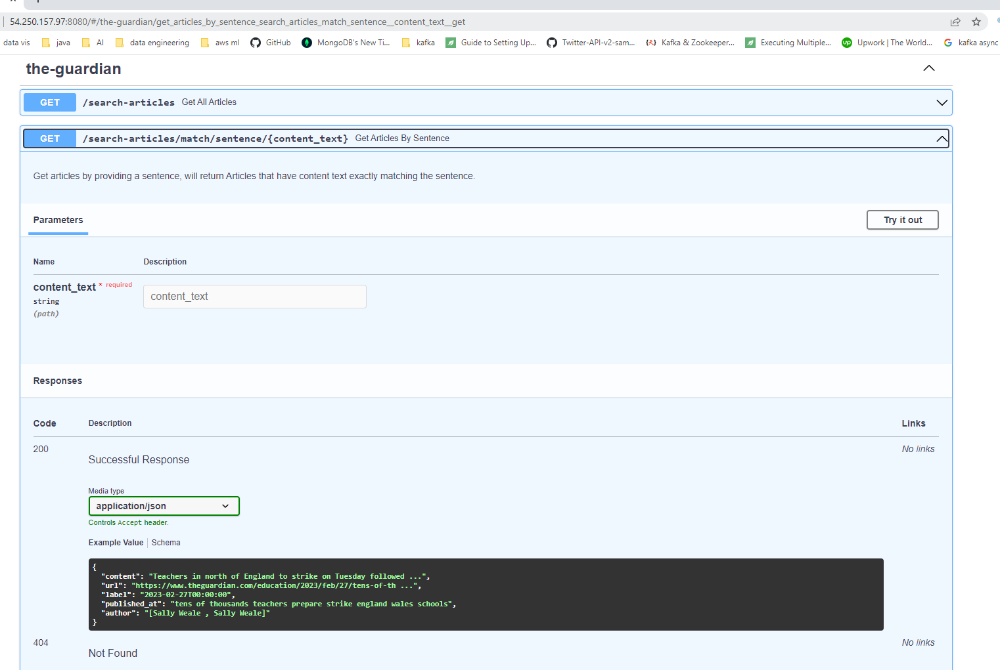
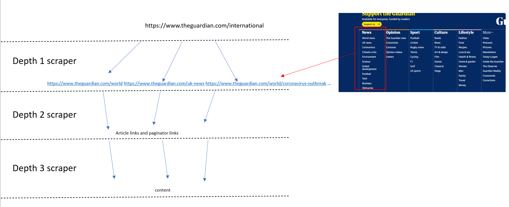
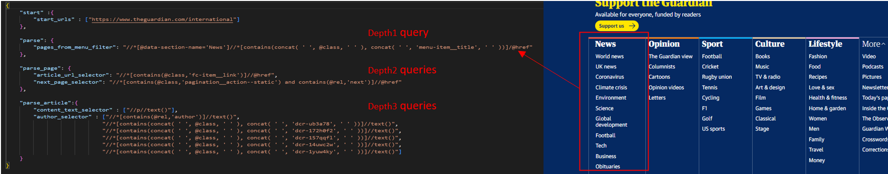
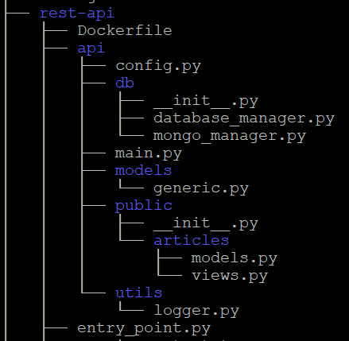
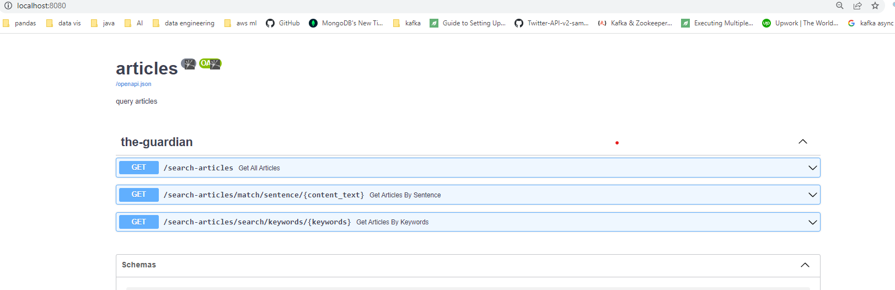
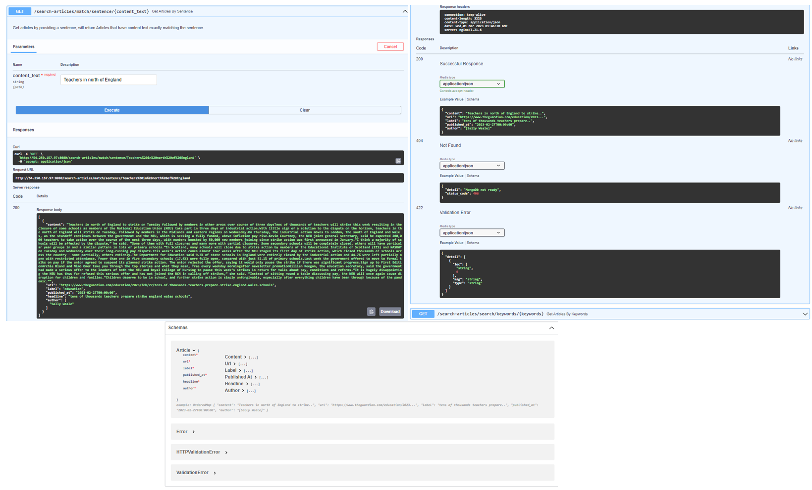
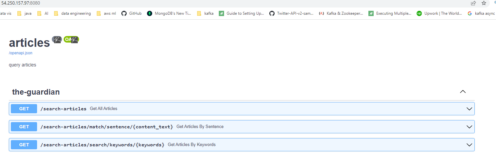

# News scrapper and rest API

In this work, https://www.theguardian.com news website was scraped in a controllable and upgradeable way. The results have been stored in a MongoDB, and a rest api was built using FastAPI, and Nginx to search the content. The solution was deployed to the cloud as per the following section.

## 1- Architecture.



### A. mongoDB

MongoDB atlas free tier cluster was deployed on AWS for the purpose of storing article data.

The schema of the documents is shown below.



A text index was created on the field content in order to allow $text searches.

NB: compose.io will be deprecated as of march 1, data on compose.io needs be migrated to IBM Cloud Databases for MongoDB.

### B. API

Fastapi was chosen for its ease of use, and ability to handle asynchronous requests making it able to scale well under heavy usage.
In this work async queries have been implemented.

Fastapi also support oauth2 authentication, making it easy to provide bearer tokens for users of organizations by querying a db or from azure AD.
This was not implemented in this work.

Finally, FastAPI provides api documentation auto implemented from the code.
The doc can be seen just by accessing the endpoint.



NB: the api documentation will appear upon accessing the api host, please refer to the How to use section of this README

### C. Nginx

Nginx has been used as TLS termination proxy between FastAPI and the physical port.

### D. Scrapper

Scrappy was containerized and will perform a scrapping every 30 minutes.

The spider was built in a way to perform a depth 3 scraping:

Depth 1 : Scrape the home page menu, get category page urls and pass them to Depth 2

Depth 2: In each category page, the spiders will get the articles URLs and pass them to depth 3 scraper.

And In each category page, the spiders will get the paginators and perform another Depth 2 scraping 

Depth 3: Get the content of the article



The links and xpath queries are loaded from a json config file, this is to ease the maintenance, adaptability to changes,
and increase the control of scraping.

As a proof of concept, the Depth1 scraper was configured to get links in the News section only.



## 2- Code and implementation.
### Overview

PEP8 style was used.

Logging was implemented for all services.

Scraping xpath configuration, and processing functions were seperated to ease maintenance,recycling, testing.

In the scraper, the config file for xpath queries is named filter_config.json, and the processing functions are defined inside process_helper.py

A test file test.py was created.

### A. Scrapy

* __Items__ : A defined dictionary that allows the organisation when passing the data between processes.
* __Spiders__: Implemented in ./TheguardiaScrapper/spiders/TheguardianSpider.py.

A Proceses that performs a Depth 3 scraping, and processes the article response. 

Two processing functions were implemented in ./TheguardiaScrapper/spiders/process_helper.py, and are used in to process data in spider threads.

* __Middlewares__: Processes that hooks in Scrapy's request/response processing in order to alter global requests and responses. In our case the middlewares were used to check if the article was already scraped and stored by checking if it's found in MongoDB.

* __Pipline__: After an item has been scraped and processed by a spider, 
        it is sent to the a pipeline named item pipline, in our case a MongoPipline will write each processed result to a mongodb collection.

* __Tests__ : the processing functions were separated so it becomes easier to perform unit testing, a unit test was implemented in test.py to check the processing functions.

### B. FastAPI

Below is the tree of rest-api/fastapi directories. 

DB queries are define in mongo_manger.py, and are exposed in views.py.

The Schema of the response is difined in models.py.



The below is an example of exposing a query in an async way.
```
async def get_articles_by_sentence (content_text: str, 
    db: DatabaseManager = Depends(get_database)
    ) -> Article:

    """Get articles by providing a sentence, will return
       Articles that have content text exactly matching the sentence.
    """
    articles = await db.articles_by_sentence(content_text=content_text)
    if articles:
        return JSONResponse(status_code=status.HTTP_200_OK, content=articles)

    raise HTTPException(
        status_code=status.HTTP_406_NOT_ACCEPTABLE,
        detail=f"No articles found containing the following sentence: {content_text}",
    )
```
where articles_by_sentence() is a query method defined in mongo_manager.py

## 3- How to Deploy.
```
If you're using windows, Please make sure that you have gitbash, and dockercompose

1- Clone the repo.
2- In Bash/git bash go to the main directory.
3- Switch the current .env file with the .env provided by email (it contains the mongourl)
4- run the following: "docker compose up -d --build"

( Please note that I need whitelist your IP adrress in order to have access to the MONGO ATLAS)
```


## 4- How to use.

NB: the api documentation will appear upon accessing the api host.

If you've deployed locally, you can access an interactive client with documentation from your browser using the below address.

```
localhost:8080
```




For the cloud deployed solution, you can access an interactive client with documentation from your browser using the below address.
```
http://54.250.157.97:8080/
```


NB: The access is not open for public.
    I will make sure to ask for, and whitelist your PUBLIC IP/VPN IP address.

